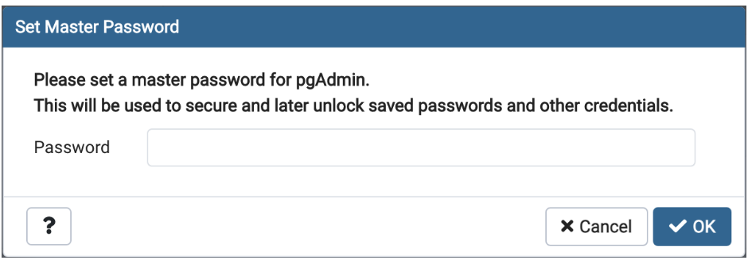
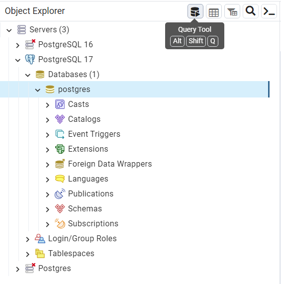
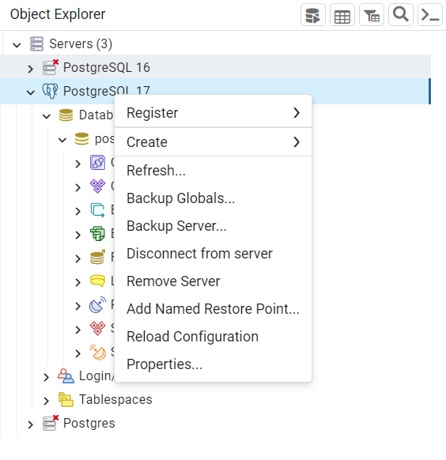
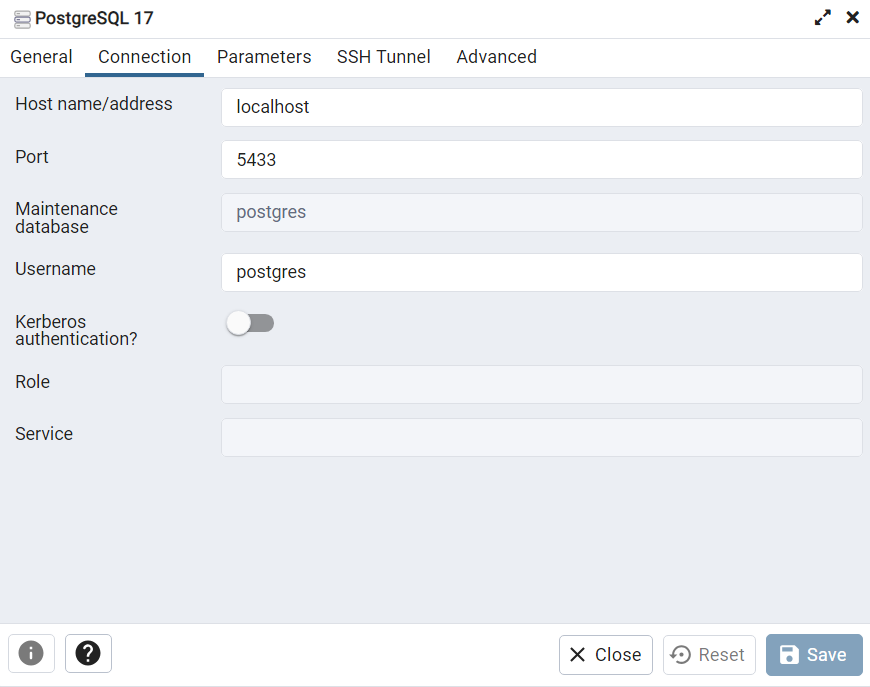

# 2024.1-MortalKombat

Repositório para a disciplina de Banco de Dados 2024.1 Grupo Mortal Kombat

## Integrantes

| Matrícula      | Nome               | GitHub                                                 |
| -------------- | ------------------ | ------------------------------------------------------ |
| 15/0137770     | Lude Ribeiro       | [@luderibeiro](www.github.com/luderibeiro)             |
| 19/0088168     | Guilerme Vilela    | [@guivilela7](https://github.com/guivilela7)           |
| 21/1006957     | Sebastián Zuzunaga | [@sebazac332](https://github.com/sebazac332)           |
| ~~00/0000000~~ | ~~Vinicius Alves~~ | ~~[@viniAlves2020](https://github.com/vinialves2020)~~ |

## Descrição do Projeto

O projeto consiste em um jogo de luta com mecânicas de torre e salas de batalha. Baseado no modo história do jogo Mortal Kombat, o jogador terá que passar por várias salas de batalha, cada uma com um inimigo diferente, e com um "Boss" a cada 4 salas, para conseguir chegar até o final do jogo. O jogador terá que escolher um personagem para jogar, e cada personagem terá suas próprias habilidades características e níveis com seus respectivos "perks".

## Como Jogar
### Requisitos
- Powershell
- Python
- PostgreSQL/pgAdmin4

#### Paso 1:
Instalar PostgreSQL, pode ser baixado aqui: https://www.postgresql.org/download/

#### Paso 2:
Uma vez concluída a instalação, você terá que definir uma master password



#### Paso 3:
Usar a ferramenta query tool do pgAdmin para executar os scripts de criação de tabelas e povoamento



#### Paso 4:
Revisar as propriedades de conexão





E garantir que os parâmetros no código coincidam

```bash
def conectar_bd():
    try:
        conn = psycopg2.connect(
            dbname="postgres",
            user="postgres",
            password="Elcachorro2022",
            host="localhost",
            port="5433"
        )
        return conn
    except Exception as e:
        print(f"Erro ao conectar ao banco de dados: {e}")
        return None
```

#### Paso 5:

Executar o powershell como administrador e usar o para encontrar o arquivo main.py

```bash
cd rota_do_repo/2024.1-MortalKombat\Jogo
```

#### Paseo 6:

Executar main.py com python

```bash
python main.py
```

## Entrega 1

-   MER: [Modelo Entidade Relacionamento](docs/Entrega1/MER_MortalKombat_v1.md)
-   DD: [Dicionário de Dados](docs/Entrega1/DD_MortalKombat_v1.md)
-   DR: [Diagrama Relacional](docs/Entrega1/DR_MortalKombat_v1.md)

## Entrega 2

-   [Scripts de Criação - SQL](docs/sql/tables/create_new.sql)
-   [Scripts de Povoamento - SQL](docs/sql/scripts/populate_new.sql)

## Entrega 3

- [Triggers/stored procedures](docs/sql/Triggers/create_triggers.sql)