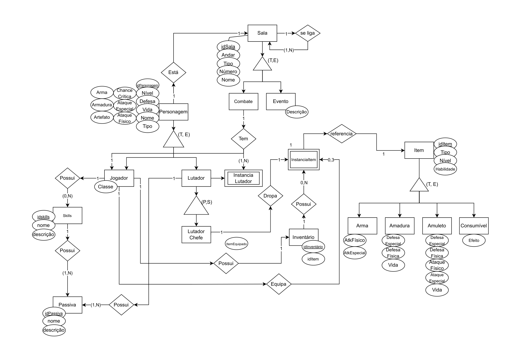

# Modelo Entidade Relacionamento (MER) - Mortal Kombat

O Modelo Entidade Relacionamento (MER) é uma ferramenta utilizada para modelar os dados de um sistema, mostrando as entidades envolvidas e os relacionamentos entre elas. O MER é uma representação gráfica que facilita a visualização e compreensão da estrutura de um banco de dados.

O diagrama fornecido uma visão geral do sistema, mostrando as entidades principais e seus atributos, bem como os relacionamentos entre elas. O MER é uma ferramenta importante para o desenvolvimento de sistemas de banco de dados, pois ajuda a identificar as entidades e relacionamentos necessários para o sistema.

  
Figura 1: DER Mortal Kombat

  
Fonte: Autores

### Histórico de Versão

| Data       | Versão | Descrição      | Autor(es)                                      |
| ---------- | ------ | -------------- | ---------------------------------------------- |
| 29/08/2021 | 1.0    | Criação do MER | Lude Ribeiro, Vinicius Alves, Guilherme Vilela |
